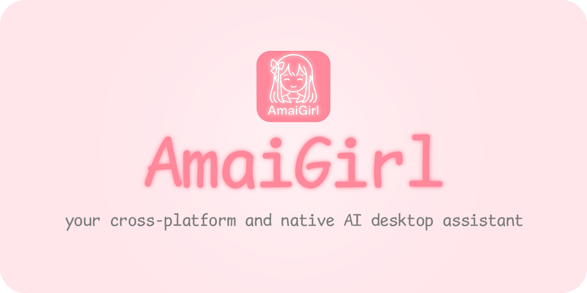

  
  <h1>AmaiGirl</h1>
  
<a href="README.md#zh-cn">简体中文</a> | <a href="README.en.md#en-us">English</a>

  
<strong>面向全平台愿景的原生 AI 桌面助手</strong> · 可支持所有 OpenAI 格式的 API 调用 · 当前已支持 macOS 13.0+、Windows 10/11（x86_64） 与 Linux（x86_64，Wayland）

  

    
    
    
    
  

---

## 应用简介

AmaiGirl 是一个以「**陪伴感 + 可扩展性 + 桌面常驻体验**」为核心目标的 AI 桌面助手项目。  
它不仅是一个聊天窗口，更希望成为你工作流中的“会说话、会互动、可持续进化”的桌面伙伴。

当前版本已在 macOS 13.0+、Windows 10/11（x86_64） 与 Linux（x86_64，Wayland）上实现基础可用闭环，后续可能继续扩展到更多平台。

## 项目定位

- **目标**：打造全平台（Cross-Platform）原生（Native）AI 桌面助手
- **当前状态**：macOS 13.0+、Windows 10/11（x86_64）、Linux（x86_64，Wayland）可运行
- **技术方向**：桌面常驻 + Live2D 角色交互 + LLM 对话 + TTS 播放

## 演示效果

> 本演示所涉及的模型来自 bilibili UP 主 [@菜菜爱吃饭ovo](https://space.bilibili.com/1851126283)，不涉及商业使用，亦不包含在项目源码或发布应用内，如有侵权请联系项目负责人。

### 快速预览

  

### 平台分组预览（点击缩略图查看原图）

| macOS | Windows | Linux |
| --- | --- | --- |
|  |  |  |

### 功能预览（点击缩略图查看原图）

| 聊天 | 设置 | i18n |
| --- | --- | --- |
|  |  |  |

| 模型切换 A | 模型切换 B | 完整图集 |
| --- | --- | --- |
|  |  |  |

展开查看全部原始大图（按平台与功能分组）

#### 平台演示

##### macOS

##### Windows

##### Linux

#### 功能演示

##### 聊天演示

##### 设置演示

##### 模型切换演示

##### i18n 演示

更多截图与说明见：[完整演示图集](docs/demo-gallery.md)

## 功能概览

- **桌面助手形态**：无边框常驻窗口、托盘菜单控制显示/隐藏
- **Live2D 模型渲染**：支持模型加载、姿态/表情、基础交互
- **AI 对话能力**：兼容 OpenAI 风格 Chat Completions 接口
- **TTS 语音能力**：兼容 OpenAI 风格 TTS 接口，可语音播报回复
- **多语言支持**：中文/英文界面切换
- **可配置化**：`基本设置` / `模型设置` / `AI设置` / `高级设置` 四大分区

## 使用指南

### 1. 启动与基础操作

- 启动后应用常驻，可通过菜单栏图标进行控制
- **通过鼠标左键移动模型，鼠标右键单击切换姿势（如果模型本身有的话），鼠标滚轮缩放模型**
- 菜单支持（括号内为对应快捷键）：
  - 显示/隐藏（macOS：`⌘ + H`，Windows / Linux：`Ctrl + H`）
  - 打开聊天（macOS：`⌘ + T`，Windows / Linux：`Ctrl + T`）
  - 打开设置（macOS：`⌘ + S`，Windows / Linux：`Ctrl + S`）
  - 关于
  - 退出（macOS：`⌘ + Q`）
- 可在 `设置 -> 基本设置` 中使用 `还原初始状态`

### 2. 模型添加与切换

1. 准备 Live2D 模型目录（每个模型一个文件夹）
2. 在 `设置 -> 基本设置` 的 `模型路径` 指向模型根目录
  - macOS / Linux 默认：`~/.AmaiGirl/Models`
  - Windows 默认：`%USERPROFILE%/Documents/AmaiGirl/Models`
3. 在 `设置 -> 基本设置` 的 `当前模型` 下拉框中切换模型
4. 切换后会自动加载对应模型配置与聊天上下文

> 提示：若模型资源许可不明确，请勿公开分发模型文件。

### 3. AI 功能使用

在 `设置 -> AI设置` 中填写以下参数：

- `对话API`：服务地址（OpenAI 兼容）
- `对话KEY`：密钥（可留空，视服务端要求）
- `对话模型`：模型名称（如 `gpt-4o-mini`）
- `对话人设`：系统提示词（系统角色提示）
- `是否流式输出`：控制回复是否以流式方式显示

进入聊天窗口后：

- 输入消息并发送
- 查看 AI 流式/完整回复
- 若出现错误，消息会以 `[Error]` 标记显示，便于与正常回复区分

### 4. TTS 语音使用

在 `设置 -> AI设置` 中填写 TTS 参数：

- `语音API`、`语音KEY`
- `语音模型`（如 `gpt-4o-mini-tts`）
- `语音音色`（如 `alloy`）

配置完成后，AI 回复可触发语音播放；播放失败时会回退文本显示并提示错误。

### 5. 资源与目录说明

- macOS 打包后资源路径：`Contents/Resources/...`
- Windows 构建输出/便携包资源路径：`<可执行目录>/res`
- Linux 构建输出/安装后资源路径：`<可执行目录>/res` 或 `../share/AmaiGirl/res`
- Windows 配置目录：`%APPDATA%/IAIAYN/AmaiGirl/Configs`
- Windows 聊天记录与缓存目录：`%LOCALAPPDATA%/IAIAYN/AmaiGirl/Chats`、`%LOCALAPPDATA%/IAIAYN/AmaiGirl/.Cache`
- 许可证文件可在 `licenses` 目录中查看

## 开发

开发说明已拆分到独立文档：

- [CONTRIBUTING.md](CONTRIBUTING.md)

该文档包含：环境要求、构建方式、提交流程、代码风格、模型与 SDK 依赖说明等。

## 协议说明

- 项目原创代码：Apache-2.0（见 [LICENSE](LICENSE)）
- 第三方组件与素材条款：见 [THIRD_PARTY_LICENSES.md](THIRD_PARTY_LICENSES.md)
- 发布包附带协议副本：见 `res/licenses/`

## 路线图

- [x] Windows 支持
- [x] Linux 基础支持
- [ ] LLM 长期记忆
- [ ] 更完善的角色动作与情感表达（VTube Studio 模型尝试调用表情）
- [ ] STT 支持（语音转文本输入）
- [ ] MCP 支持（Tools 工具调用支持）
- [ ] 插件化能力（工具扩展）

## 鸣谢

> 本项目的出现离不开以下项目或文档的贡献（排序不分先后）。

- [Copilot](https://github.com/features/copilot)：完成了本项目大部分代码的编写
- [Cubism SDK手册](https://docs.live2d.com/zh-CHS/cubism-sdk-manual/top/)：提供部分与 Live2D 控制相关的代码逻辑参考
- [sk2233 / live2d](https://github.com/sk2233/live2d)：提供直接调用 Cubism SDK Core 的代码参考
- [EasyLive2D / live2d-py](https://github.com/EasyLive2D/live2d-py)：提供口型同步的代码参考
