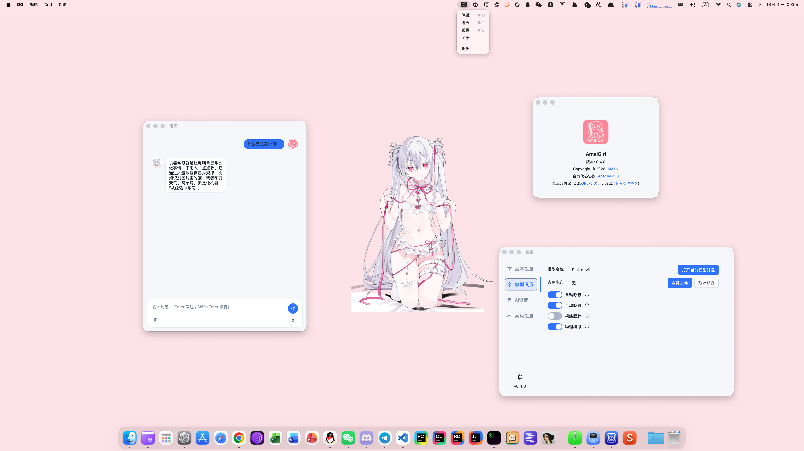
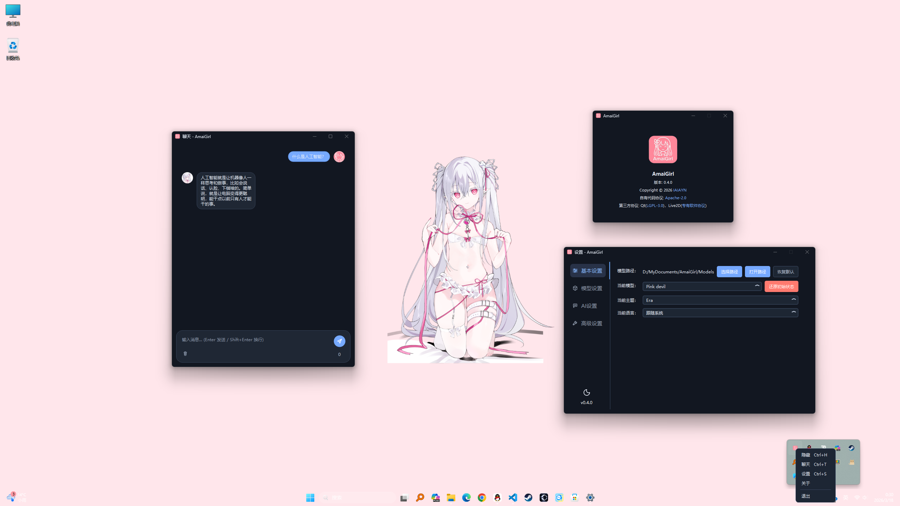
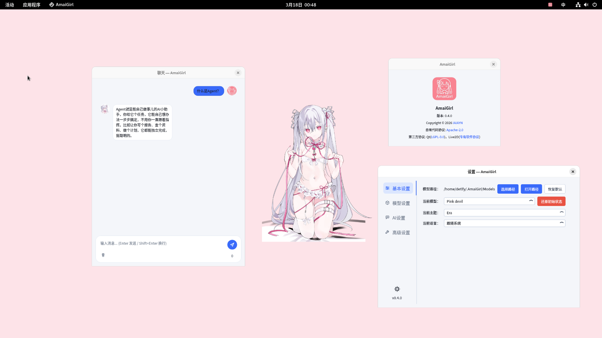
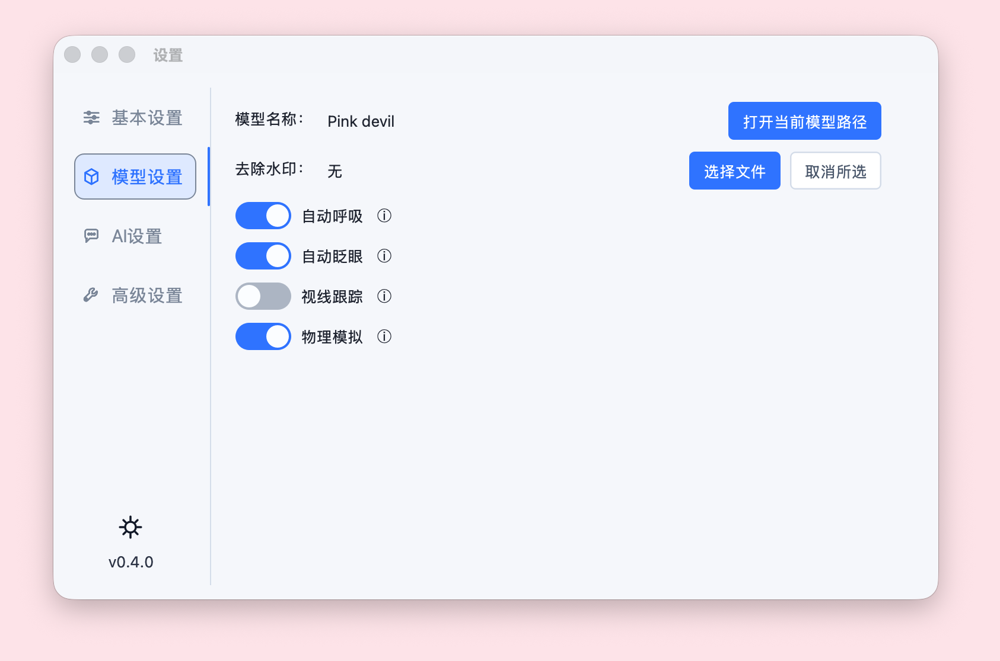
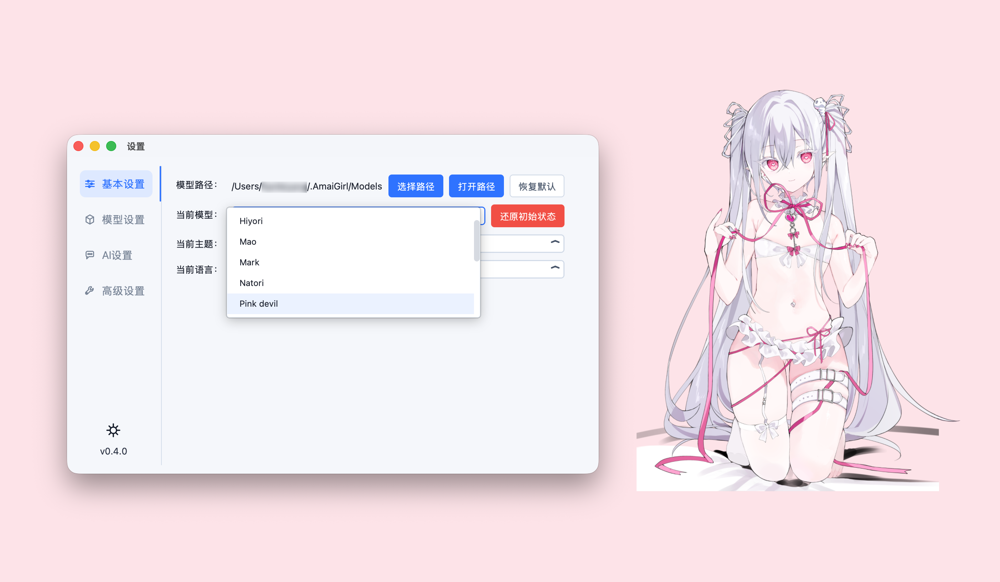
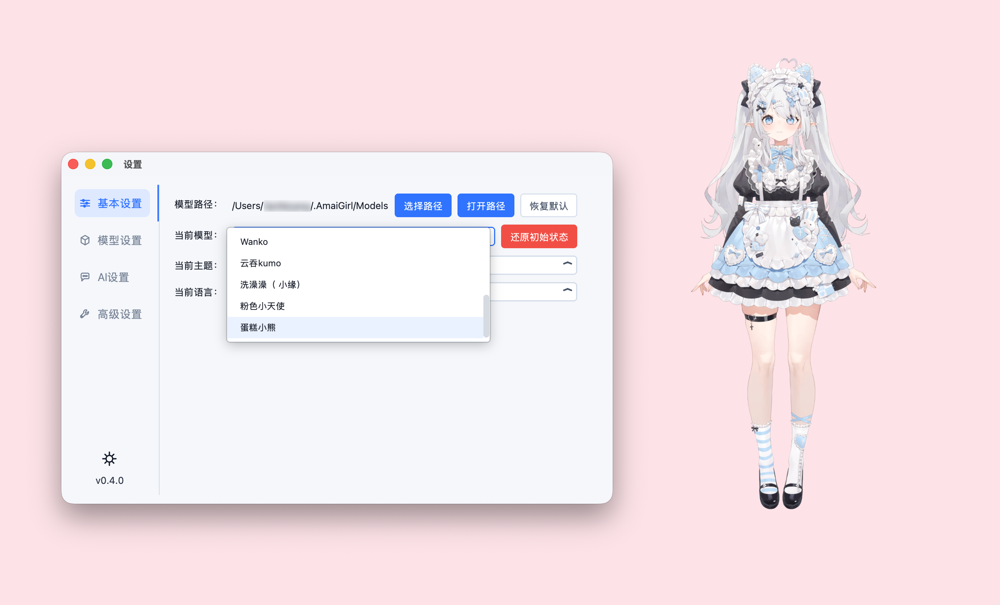
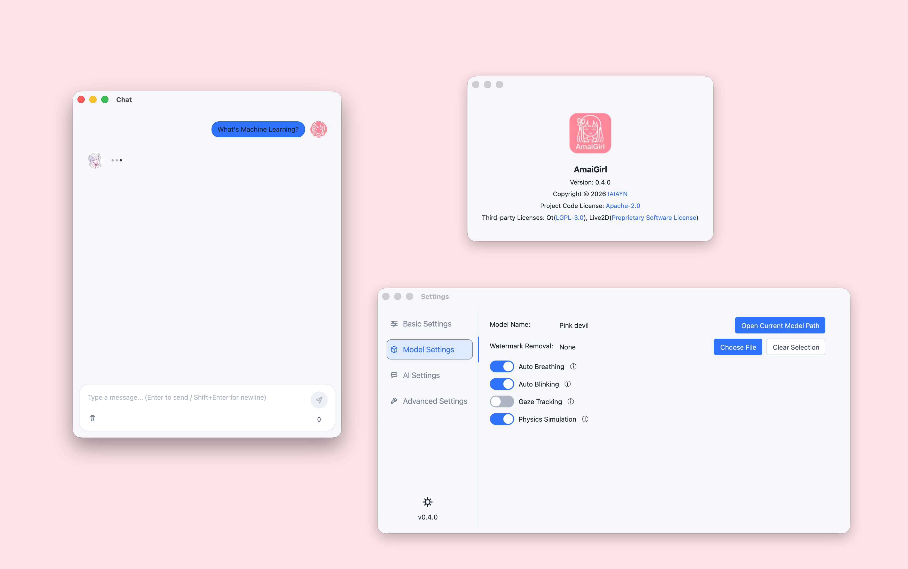

# 完整演示图集

该页面收录 README 中的全部演示截图，便于集中浏览、对比不同界面状态，以及在首屏之外保留完整展示内容。

> 本演示所涉及的模型来自 bilibili UP 主 [@菜菜爱吃饭ovo](https://space.bilibili.com/1851126283)，不涉及商业使用，亦不包含在项目源码或发布应用内。演示桌面背景来源网络，如有侵权请联系项目负责人。

返回首页：[README.md](../README.md)

## 平台演示

### macOS

### Windows

### Linux

## 功能演示

### 聊天演示

### 设置演示

### 模型切换演示

### i18n 演示

